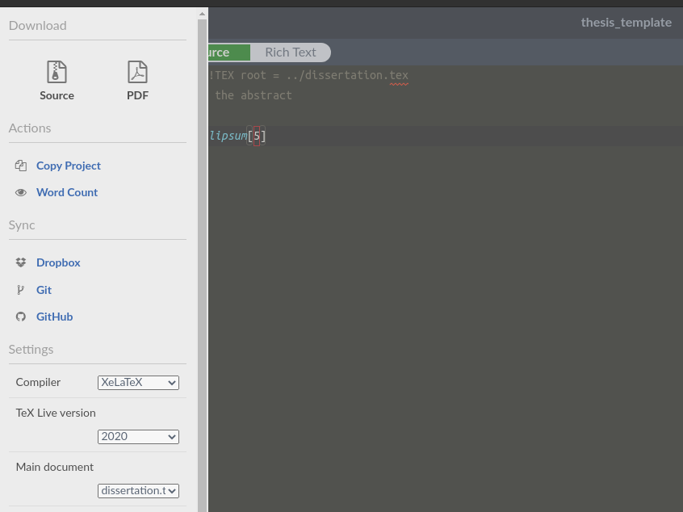

# PhD thesis template

Template for PhD thesis with customized title page conforming to requirement from the University of Amsterdam. This template has been used to format [my thesis](http://hdl.handle.net/11245.1/57c8d00a-9a32-4c96-a512-231dc6bb27df).

## Features
AFAIK, the University of Amsterdam (UvA) does not dictate a strict template for PhD theses, only the title page which will be given by the Office of the Beadle. The following features are made for my taste only, which hopefully could catch your eyes.
- Title page conforming to the [requirement of UvA](https://www.uva.nl/binaries/content/assets/uva/en/research/phd/procedures/appendix-b---model-title-page-for-doctoral-thesis-2018_27-09-2019.pdf). Again the title page will be provided by the Office of the Beadle once the these defense is scheduled. This version is only meant to replicate that with some customization in style (font size and color). You can just take their version and attach to the compiled pdf as post-production for the ease of mind.
- Each chapter starts with an [epigraph](https://en.wikipedia.org/wiki/Epigraph_(literature))
- Chapter abstracts begin with [initials, aka drop cap](https://en.wikipedia.org/wiki/Initial) (using `lettrine` package)
- Each chapter contains a [thumb index](https://en.wikipedia.org/wiki/Thumb_index) that displaces one after another chapter. The thumb indices extend to the bleeding margin of the page show the marks will show up after cut.

**Disclaimer**  Although the template has been used to format [my thesis](http://hdl.handle.net/11245.1/57c8d00a-9a32-4c96-a512-231dc6bb27df), it does not mean it always conforms to UvA regulations, especially when there are revisions. A certain elements that I'd seen from previous theses have been disapproved during my time. So always double check with the Office of the Beadle and the up-to-date [documents and forms](https://www.uva.nl/en/research/phd/documents-and-forms/documents-and-forms.html).

## Getting started
This project is run and compiled from [Overleaf](overleaf.com) using XeLaTeX (due to the personalized fonts).
It is highly recommended to use Overleaf to compile it. To activate XeLaTeX compiler in Overleaf, go to `Menu` (on the top-left corner of Overleaf), and change the compiler (see image).


The following steps are copied from the [original repository](https://github.com/suchow/Dissertate) from which this template was customized.

1. Install LaTeX. For Mac OS X, we recommend MacTex (http://tug.org/mactex/); for Windows, MiKTeX (http://miktex.org/); and for Ubuntu, Tex Live (`sudo apt-get install texlive-full`)
2. Install the default fonts: EB Garamond, Lato, and Source Code Pro. The files are provided in `fonts/EB Garamond`, `fonts/Lato`, and `fonts/Source Code Pro`.
3. Personalize the document by filling out your name and all the other info in `frontmatter/personalize.md`.
4. Build your dissertation with `build.command`, located in the `scripts` directory (e.g., you can `cd` into the main directory and then run `./scripts/build.command`).

**How do I make the text justified instead of ragged right?**
Remove or comment out the line `\RaggedRight` from the .cls file.

## Structure

Following are the general structure of the thesis

`disseration.tex`, the main file

`chapters` directory,  where all the chapters go
- each individual chapter files have to be added to the main `disseration.tex` file.

`figures` directory, where all figures go

`frontmatter` directory
- `copyright.tex`: copyright notice and ISBN number
- `dedication.tex`: dedication message
- `funding.tex`: acknowledge funding agency, ASCI and UvA logo 
- `personalize.tex`: title page information (thesis title, names of author, supervisors, committee members, defense place and time), thesis color theme
- `quote.tex`: the thesis epigraph
- `thanks.tex`: acknowledgement (which is placed at the end of the thesis)

BibTex file is currently `my_bibs.bib`. The setup is in `Dissertate.cls` (L531) and currently set to `my_bibs`

## Layout

The thesis layout is down according to the [dimension guideline](https://www.offpage.nl/wp-content/uploads/2016/08/Dimension_guidelines.pdf) of Offpage.
The page margins can be done in `Dissertate.cls` file, L81 onward. The bleeding margin will be 
cut off after printing. The cut mark is currently shown, hence 3mm from the page edge, and
can be removed by removing `showcrop` at L88.

```latex
paperwidth=176mm,   % full page width (content + 2 real margins + 2 horizontal bleeding margins)
paperheight=246mm,  % full page height (content + 2 real margins + 2 vertical bleeding margins )
layoutwidth=170mm,  % content width
layoutheight=240mm, % content height
layouthoffset=3mm,  % single horizontal bleeding 
layoutvoffset=3mm,  % single vertical bleeding margin
margin=20mm,        % single margin size
showcrop            % to show cut mark of bleeding margins
```

## Credit

This template is customized from the [Dissertate template](https://github.com/suchow/Dissertate) by @suchow.
